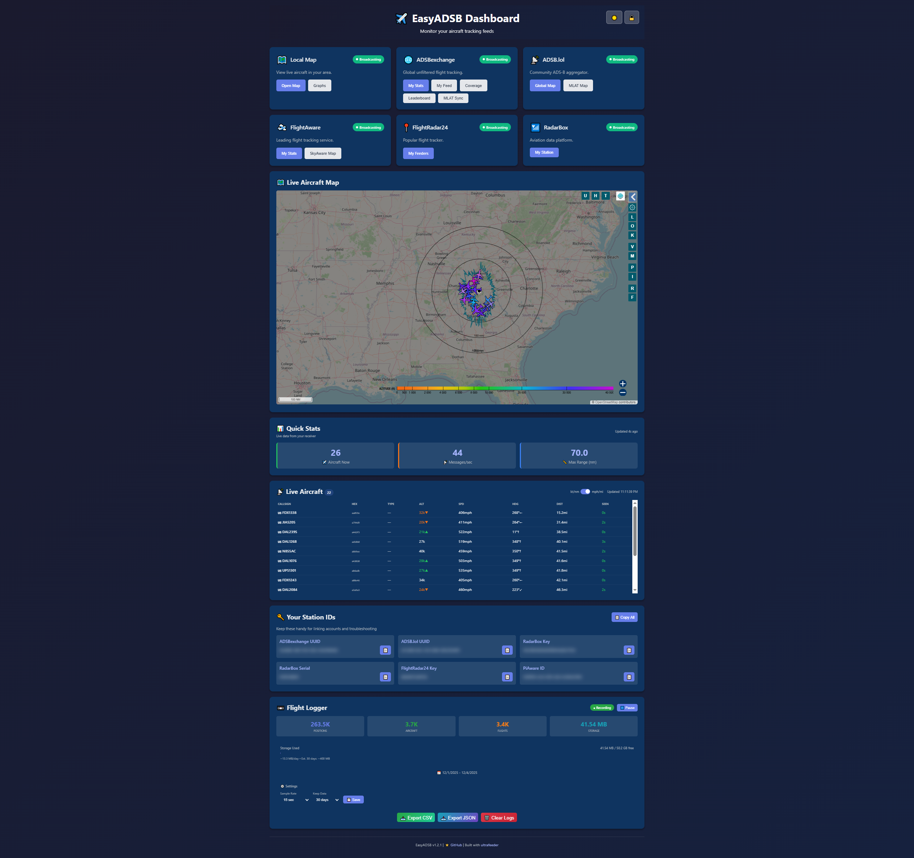
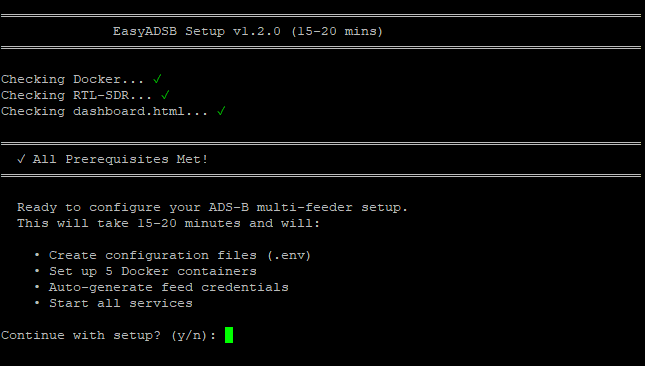
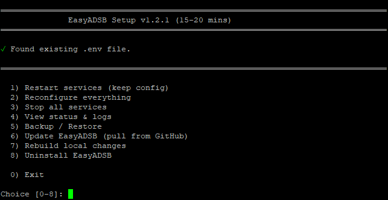
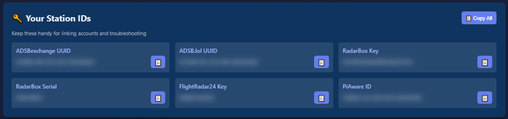
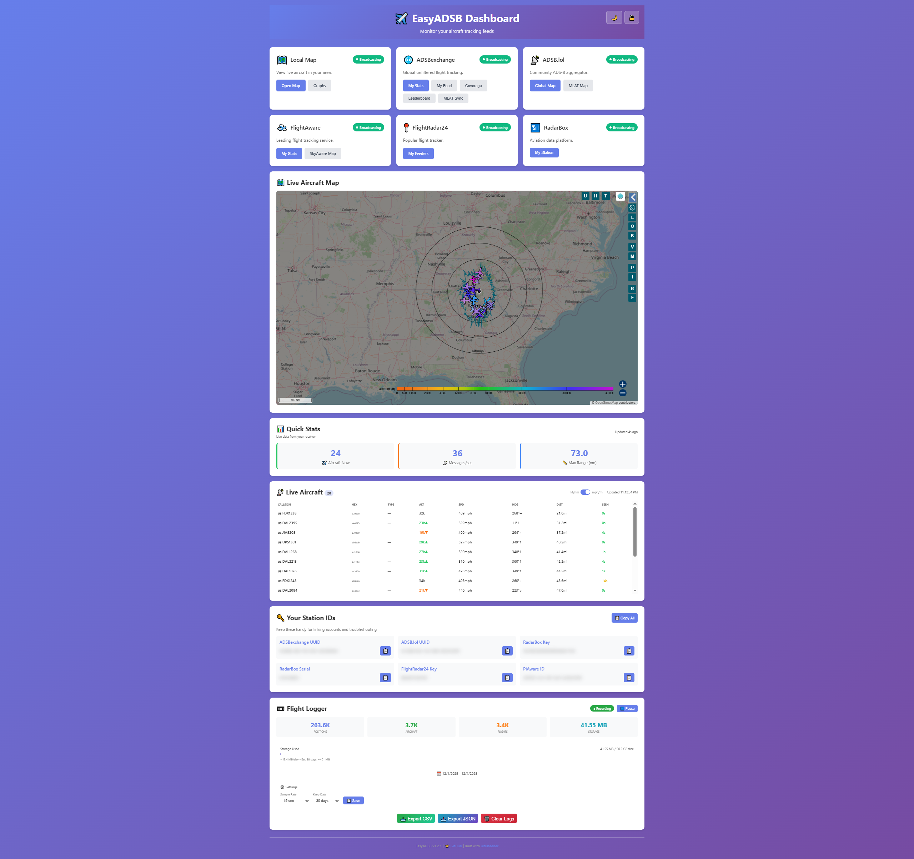
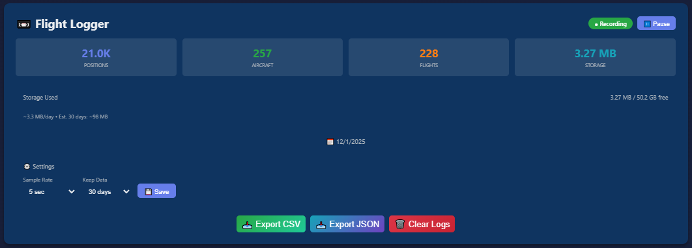
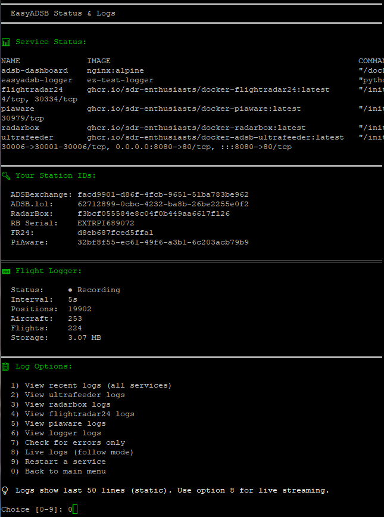
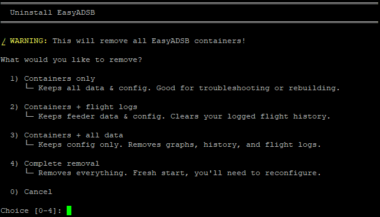
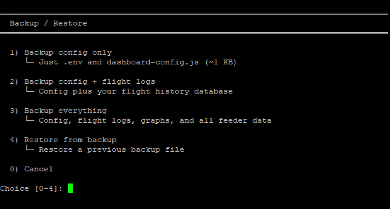

# 🛰️ EasyADSB

**The easiest way to set up multi-feed ADS-B tracking on your Raspberry Pi**

One command. 15-20 minutes. Six flight tracking networks. Zero headaches.



---

## 🎯 What is EasyADSB?

EasyADSB is an **all-in-one automated setup script** that turns your Raspberry Pi + RTL-SDR dongle into a powerful ADS-B receiver feeding data to **six major flight tracking networks**:

- 🌐 **ADSBexchange** - Global unfiltered tracking
- 📡 **ADSB.lol** - Privacy-focused community aggregator
- 🛫 **FlightAware** - Leading commercial flight tracker
- 📍 **FlightRadar24** - Popular worldwide tracker
- 📶 **RadarBox** - Aviation data platform
- 🗺️ **Local tar1090** - Your own web-based map

**Plus:** A beautiful web dashboard to monitor everything in one place!

---

## ✨ Key Features

- ✅ **One-Command Setup** - Run `./setup.sh` and follow the prompts
- ✅ **Auto-Configuration** - Automatically generates keys and IDs for all services
- ✅ **Flight Logger** - Save all flights to local database, export CSV/JSON (NEW!)
- ✅ **Configurable Ports** - Avoid conflicts with other services (NEW!)
- ✅ **Auto-Update** - Pull latest updates from GitHub
- ✅ **Web Dashboard** - Modern interface with live aircraft tracking
- ✅ **Dark Mode** - Easy on the eyes, looks great
- ✅ **Real-Time Stats** - Aircraft count, message rate, max range
- ✅ **Mobile Responsive** - Works on phone, tablet, desktop
- ✅ **Easy Uninstall** - Remove everything cleanly
- ✅ **Zero Manual Config** - No editing config files (unless you want to)

---

## 📋 Requirements

### Hardware
- **Raspberry Pi** (3B+, 4, or 5 recommended)
- **RTL-SDR Dongle** (any RTL2832U-based dongle)
- **Antenna** (optimize for 1090 MHz)
- **Internet Connection** (Ethernet recommended)
- **MicroSD Card** (16GB+ recommended)

### Software
- **Raspberry Pi OS** (Lite or Desktop)
- **Docker** and **Docker Compose**
- **SSH Access** (to run commands)

### Optional but Recommended
- Fixed location with good sky view
- Powered USB hub (for stable SDR power)
- LNA (Low Noise Amplifier) for better range

---

## 🚀 Quick Start (Simple Method)

**This is the easiest way - perfect for beginners!**

### Step 1: Install Prerequisites

```bash
# Update system
sudo apt update && sudo apt upgrade -y

# Install Docker
curl -fsSL https://get.docker.com | sh
sudo usermod -aG docker $USER

# Install Docker Compose
sudo apt install docker-compose -y

# Reboot to apply group changes
sudo reboot
```

### Step 2: Clone EasyADSB

```bash
cd ~
git clone https://github.com/datboip/easyadsb.git
cd easyadsb
```

### Step 3: Run Setup Script

```bash
chmod +x setup.sh
./setup.sh
```

For first-time setup, the wizard runs automatically:



For returning users, you'll see the management menu:



### Step 4: Follow the Interactive Wizard

The script will guide you through:

1. **Enter Your Location**
   - Latitude, longitude, altitude (meters)
   - Timezone (e.g., `America/New_York`)
   - Station name (e.g., `MyADSB`)

2. **Configure Ports & Logger**
   - Dashboard port (default: 8081)
   - Flight logger settings (sample rate, retention)

3. **Configure Services** (All Automatic!)
   - ✅ ADSBexchange: Auto-generates UUID
   - ✅ ADSB.lol: Auto-generates UUID
   - ✅ FlightRadar24: Auto-generates sharing key
   - ✅ RadarBox: Auto-generates key + serial
   - ✅ FlightAware: Auto-generates PiAware ID
   
   *You can skip any service or enter your own keys if you already have them*

4. **Start Services**
   - Docker containers are built and started
   - Services connect to aggregators
   - Dashboard becomes available

### Step 5: Access Your Dashboard

Open your browser and go to:
```
http://YOUR-RASPBERRY-PI-IP:8081
```

**Find your IP:**
```bash
hostname -I
```

---

## 🎛️ Dashboard Features

### Live Aircraft Tracking
- **Recent Aircraft List** - Last 10 detected aircraft with flight number, altitude, distance
- **Auto-Refresh** - Updates every 5 seconds
- **Interactive Map** - Embedded tar1090 map showing all aircraft

### Quick Stats
- **Aircraft Count** - Total aircraft currently visible
- **Messages/Second** - Data throughput from your receiver
- **Max Range** - Furthest aircraft detected

### Feed Status
- **Broadcasting Status** - Live indicators for all 6 services
- **Direct Links** - One-click access to your stats on each platform
- **Station IDs** - All your UUIDs and keys with copy buttons



### Dark Mode
- **Toggle Switch** - Click sun/moon icon in header
- **Persistent** - Remembers your preference
- **Optimized Colors** - Perfect contrast in both modes


*Light mode is also available for daytime viewing*

---

## 📼 Flight Logger

**NEW in v1.2.0!** Keep a record of every aircraft you track.



### What It Does

- **Saves all aircraft positions** to a local SQLite database
- **Configurable sample rate** (5-60 seconds)
- **Auto-cleanup** - Keeps last 7/14/30 days or forever
- **Export to CSV/JSON** - Download your data anytime
- **Storage estimates** - Know how much space you'll need

### Dashboard Integration

The logger section appears in your dashboard with:
- Real-time statistics (positions, aircraft, flights)
- Storage usage bar
- Settings controls (sample rate, retention)
- Export/Clear buttons

### Configuration

During setup, you'll be asked:
```
Enable flight logging? (Y/n): y

Sample rate:
  1) 5 seconds  (~200MB/day)
  2) 10 seconds (~100MB/day) [recommended]
  3) 15 seconds (~70MB/day)
  4) 30 seconds (~35MB/day)

Keep data:
  1) 7 days
  2) 14 days [recommended]
  3) 30 days
  4) Forever
```

### Storage Estimates

| Sample Rate | Per Day | 7 Days | 14 Days | 30 Days |
|-------------|---------|--------|---------|---------|
| 5 sec       | ~200MB  | 1.4GB  | 2.8GB   | 6GB     |
| 10 sec      | ~100MB  | 700MB  | 1.4GB   | 3GB     |
| 15 sec      | ~70MB   | 500MB  | 1GB     | 2GB     |
| 30 sec      | ~35MB   | 250MB  | 500MB   | 1GB     |

*Estimates based on ~50 aircraft average. Busy areas = more data.*

### API Endpoints

The logger also provides a REST API:
```
GET  /api/stats       - Statistics
GET  /api/export      - Download CSV
GET  /api/export/json - Download JSON
GET  /api/flights     - Query flights
GET  /api/trace/<icao> - Get flight path
POST /api/pause       - Pause logging
POST /api/resume      - Resume logging
```

---

## ⚙️ Advanced Setup (Manual Method)

**For users who want more control or already have some credentials**

### Manual Docker Setup

If you prefer to set up Docker containers manually instead of using the script:

#### 1. Create Your `.env` File

Copy the example and edit with your details:
```bash
cp .env.example .env
nano .env
```

Required variables:
```bash
# Location Settings
FEEDER_TZ=America/New_York
FEEDER_LAT=40.7128
FEEDER_LONG=-74.0060
FEEDER_ALT_M=10
FEEDER_NAME=MyStation

# Service Credentials (generate or use existing)
MULTIFEEDER_UUID=xxxxxxxx-xxxx-xxxx-xxxx-xxxxxxxxxxxx
ADSBX_UUID=xxxxxxxx-xxxx-xxxx-xxxx-xxxxxxxxxxxx
FR24KEY=xxxxxxxxxxxxxxxxxx
RADARBOX_KEY=xxxxxxxxxxxxxxxxxxxxxxxxxxxxxxxx
RADARBOX_SERIAL=EXTRPIXXXXXX
PIAWARE_FEEDER_ID=xxxxxxxx-xxxx-xxxx-xxxx-xxxxxxxxxxxx
```

#### 2. Generate Service Credentials Manually

**ADSBexchange:**
```bash
# Generate UUID
uuidgen
# Use this as ADSBX_UUID
```

**ADSB.lol:**
```bash
# Generate UUID
uuidgen
# Use this as MULTIFEEDER_UUID
```

**FlightRadar24:**
```bash
# Run temp container to generate key
docker run --rm -it --entrypoint /bin/bash \
  ghcr.io/sdr-enthusiasts/docker-flightradar24:latest \
  -c "fr24feed --signup"

# Follow prompts, save the sharing key as FR24KEY
```

**RadarBox:**
```bash
# Run temp container to generate key
docker run --rm -it \
  -e BEASTHOST=127.0.0.1 \
  -e UAT_RECEIVER_HOST=127.0.0.1 \
  ghcr.io/sdr-enthusiasts/docker-radarbox:latest

# Watch logs for: "Your new key is: XXXXXXX"
# And: "station serial number: EXTRPIXXXXXX"
```

**FlightAware:**
```bash
# PiAware generates its own ID on first run
# Just start the container and check logs
docker compose up -d piaware
docker compose logs piaware | grep "feeder-id"
```

#### 3. Create Dashboard Config

```bash
cat > dashboard-config.js << 'EOF'
window.FEEDER_CONFIG = {
    adsbxUUID: "your-adsbx-uuid",
    adsbLolUUID: "your-adsblol-uuid",
    fr24Key: "your-fr24-key",
    radarboxKey: "your-radarbox-key",
    radarboxSerial: "your-radarbox-serial",
    piawareID: "your-piaware-id"
};
EOF
```

#### 4. Start Services

```bash
# Start all containers
docker compose up -d

# Check status
docker compose ps

# View logs
docker compose logs -f
```

#### 5. Verify Everything Works

```bash
# Check ultrafeeder is feeding
docker compose logs ultrafeeder | grep -i "connected"

# Check RadarBox connection
docker compose logs radarbox | grep -i "connected\|data sent"

# Check PiAware connection
docker compose logs piaware | grep -i "connection"

# Check FR24 connection
docker compose logs flightradar24 | grep -i "connected"
```

### Using Existing Credentials

**If you already have accounts and credentials:**

1. **Skip auto-generation** in setup.sh
2. Choose option "Enter manually" for each service
3. Paste your existing UUIDs/keys
4. Setup will configure everything with your credentials

**To update credentials later:**
```bash
# Edit .env file
nano .env

# Regenerate dashboard config
./setup.sh
# Choose option 6 (View Configuration)
# This will show your current config

# Or manually update dashboard-config.js
nano dashboard-config.js

# Restart services to apply changes
docker compose restart
```

---

## 🛠️ Management & Troubleshooting

### Using the Setup Script Menu

Run `./setup.sh` anytime to access the management menu:

```
  1) Restart services (keep config)
  2) Reconfigure everything
  3) Stop all services
  4) View status & logs
  5) Backup / Restore
  6) Update EasyADSB (pull from GitHub)
  7) Uninstall EasyADSB
  8) Exit
```

### View Status & Logs

Choose option 4 to see container status, your station IDs, and logger stats:



### Update EasyADSB

Keep your installation up to date:

```bash
./setup.sh
# Choose option 7 (Update EasyADSB)
```

**What it does:**
- Pulls latest code from GitHub
- Backs up your .env file
- Regenerates dashboard config
- Restarts services with new code
- Preserves all your credentials

### Uninstall EasyADSB

Remove EasyADSB completely:

```bash
./setup.sh
# Choose option 7 (Uninstall)
```



**Uninstall options:**
- **Containers only** - Keeps data & config. Good for troubleshooting.
- **Containers + flight logs** - Clears your logged flight history.
- **Containers + all data** - Removes graphs, history, and flight logs.
- **Complete removal** - Fresh start, you'll need to reconfigure.

**Complete removal:**
```bash
cd ~/easyadsb
./setup.sh  # Choose option 7, then option 4
cd ..
rm -rf easyadsb
```

### Common Commands

**Restart all services:**
```bash
docker compose restart
```

**Stop all services:**
```bash
docker compose down
```

**Start all services:**
```bash
docker compose up -d
```

**View logs (all):**
```bash
docker compose logs -f
```

**View logs (specific service):**
```bash
docker compose logs -f ultrafeeder
docker compose logs -f radarbox
docker compose logs -f piaware
docker compose logs -f flightradar24
```

**Update to latest images:**
```bash
docker compose pull
docker compose up -d
```

**Restart individual service:**
```bash
docker compose restart ultrafeeder
docker compose restart radarbox
docker compose restart piaware
docker compose restart flightradar24
docker compose restart dashboard
```

### Troubleshooting

#### Dashboard Not Loading
```bash
# Check if container is running
docker compose ps dashboard

# Check dashboard logs
docker compose logs dashboard

# Try restarting
docker compose restart dashboard

# Verify port 8081 is accessible
sudo netstat -tulpn | grep 8081
```

#### No Aircraft Showing
```bash
# Check if RTL-SDR is detected
lsusb | grep RTL

# Check ultrafeeder logs
docker compose logs ultrafeeder | tail -50

# Verify antenna connection
# Check if SDR is not being used by another process
sudo killall rtl_*
docker compose restart ultrafeeder
```

#### Services Not Connecting
```bash
# Check internet connection
ping -c 4 8.8.8.8

# Check if feeds are configured
docker compose logs ultrafeeder | grep -i "feed"

# Verify .env file
cat .env | grep -v "^#"

# Restart specific service
docker compose restart [service-name]
```

#### RadarBox Serial Not Showing
```bash
# Check RadarBox logs for serial
docker compose logs radarbox | grep -i "serial"

# If found, run setup to auto-detect it
./setup.sh
# Choose option 1 (Restart Services)
# Script will detect and update serial automatically
```

#### Dashboard Shows Wrong Location
```bash
# Update .env file
nano .env
# Update FEEDER_LAT, FEEDER_LONG, FEEDER_ALT_M

# Restart services
docker compose restart

# Clear browser cache and reload dashboard
```

---

## 📊 Service Details

### What Each Container Does

**ultrafeeder:**
- Main ADS-B decoder and aggregator
- Feeds data to ADSBexchange, ADSB.lol, and FR24
- Runs tar1090 web interface (port 8080)
- Handles MLAT (multilateration)

**radarbox:**
- Dedicated RadarBox feeder
- Generates own station serial
- Reports stats back to RadarBox

**piaware:**
- FlightAware feeder
- Auto-generates feeder ID
- Sends data to FlightAware network

**flightradar24:**
- FR24 dedicated feeder
- Uses sharing key from auto-signup
- Sends data to FR24 network

**dashboard:**
- Nginx serving dashboard.html
- Available on port 8081
- Static file server (no backend)

### Port Mappings

- **8080** - tar1090 map (ultrafeeder)
- **8081** - EasyADSB dashboard
- **30005** - Beast output from ultrafeeder
- **30105** - MLAT output

### Data Flow

```
RTL-SDR Dongle
      ↓
  ultrafeeder (decodes ADS-B signals)
      ↓
  ├─→ ADSBexchange
  ├─→ ADSB.lol (with MLAT)
  ├─→ FlightRadar24
  └─→ tar1090 (local map)

  radarbox ← ultrafeeder (Beast data)
  piaware ← ultrafeeder (Beast data)
  flightradar24 ← ultrafeeder (Beast data)
```

---

## 🔧 Customization

### Changing Your Location

Edit `.env` file:
```bash
nano .env
```

Update these values:
```bash
FEEDER_LAT=40.7128      # Your latitude
FEEDER_LONG=-74.0060    # Your longitude
FEEDER_ALT_M=10         # Your altitude in meters
FEEDER_TZ=America/New_York  # Your timezone
```

Restart services:
```bash
docker compose restart
```

### Adding More Feeds

Edit `docker-compose.yml` and `.env` to add additional aggregators.

Example ULTRAFEEDER_CONFIG format:
```bash
ULTRAFEEDER_CONFIG=adsb,feed.example.com,30004,beast_reduce_plus_out,uuid=YOUR-UUID
```

### Custom SDR Settings

If you have multiple SDRs or need PPM correction:

Edit `.env`:
```bash
ADSB_SDR_SERIAL=00001234  # Serial of your SDR
ADSB_SDR_PPM=0            # PPM correction value
```

Find your SDR serial:
```bash
rtl_test
```

### Dashboard Customization

The dashboard reads from `dashboard-config.js`. You can edit this file directly or regenerate it using `./setup.sh`.

---

## 🌟 Pro Tips

### Optimize Your Range

1. **Antenna Height** - Higher is better
2. **Antenna Type** - 1090 MHz optimized (collinear, ground plane)
3. **LNA** - Low noise amplifier between antenna and SDR
4. **Filter** - 1090 MHz SAW filter to reduce interference
5. **USB Extension** - Keep SDR away from Pi to reduce RFI
6. **Grounding** - Proper grounding helps reduce noise

### Monitor Performance

Check your stats regularly:
- ADSBexchange: See your coverage map
- FlightAware: Track your statistics and ranking
- ADSB.lol: View your MLAT contributions
- tar1090: Monitor local reception

### Claiming Your Stations

**FlightAware:**
1. Go to https://flightaware.com/adsb/piaware/claim
2. Enter your PiAware ID (from dashboard)
3. Link to your FlightAware account

**RadarBox:**
1. Go to https://www.radarbox.com
2. Create account
3. Go to "My Stations"
4. Enter your station serial (from dashboard)

### Backup Your Config

**Easy way (recommended):**
```bash
./setup.sh
# Choose option 5 (Backup / Restore)
```



Backup options:
- **Config only** (~1 KB) - Just .env and dashboard-config.js
- **Config + flight logs** - Includes your flight history database
- **Everything** - Config, flight logs, graphs, and all feeder data

Backups are saved to your home directory as `easyadsb-*.tar.gz`

**Manual backup:**
```bash
cp .env .env.backup
cp dashboard-config.js dashboard-config.js.backup
```

---

## 🤝 Contributing

Found a bug? Have a feature request? Contributions are welcome!

1. Fork the repository
2. Create your feature branch (`git checkout -b feature/AmazingFeature`)
3. Commit your changes (`git commit -m 'Add some AmazingFeature'`)
4. Push to the branch (`git push origin feature/AmazingFeature`)
5. Open a Pull Request

---

## 📜 License

This project is licensed under the MIT License - see the [LICENSE](LICENSE) file for details.

---

## 🙏 Credits

**EasyADSB** is built on the shoulders of giants:

- **[ultrafeeder](https://github.com/sdr-enthusiasts/docker-adsb-ultrafeeder)** by sdr-enthusiasts - The amazing all-in-one ADS-B aggregator
- **[tar1090](https://github.com/wiedehopf/tar1090)** by wiedehopf - Beautiful web-based aircraft map
- **[docker-flightradar24](https://github.com/sdr-enthusiasts/docker-flightradar24)** by sdr-enthusiasts
- **[docker-piaware](https://github.com/sdr-enthusiasts/docker-piaware)** by sdr-enthusiasts
- **[docker-radarbox](https://github.com/sdr-enthusiasts/docker-radarbox)** by sdr-enthusiasts

**Special Thanks:**
- The sdr-enthusiasts team for their incredible Docker images
- The ADS-B community for sharing knowledge and data
- Flight tracking networks for making aviation data accessible

---

## 📞 Support

- **Issues:** [GitHub Issues](https://github.com/datboip/easyadsb/issues)
- **Discussions:** [GitHub Discussions](https://github.com/datboip/easyadsb/discussions)

---

## ⭐ Star History

If you find EasyADSB useful, please consider giving it a star on GitHub!

---

**Made with ❤️ by datboip**

*Happy tracking!* ✈️📡
